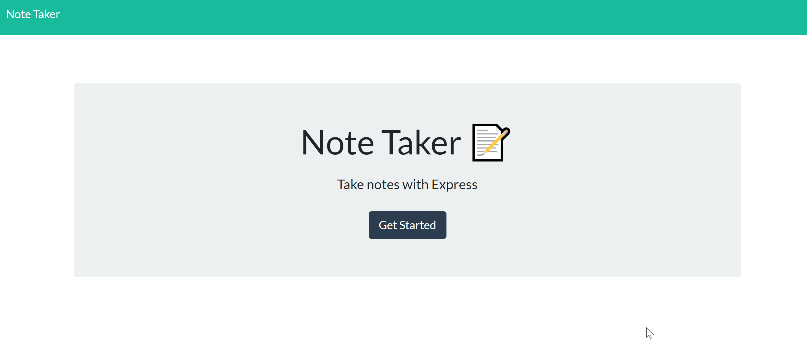

# Note-Taker
:notebook_with_decorative_cover: Note application that can be used to write, save, and delete notes using an express backend.
 
It dynamically saves and retrieves note data from a JSON file :open_file_folder:

# Screenshots

# Tech/framework used
* Programming Languages: JavaScript, HTML, CSS
* CSS Framework: Bootstrap 4
* Platform/Framework: Node.js, npm
* Library/Package: Express
* Other tools: Git, Visual Studio Code, Font Awesome, Google Fonts

# Setup
To run this project:
- Option 1:
    1. Clone to your computer :computer:
    <pre> git clone https://github.com/schoe14/Note-Taker.git </pre>
    2. Install packages :star2:
    <pre> npm install </pre>
    3. Command :+1:
    <pre> node server </pre>
- Option 2:
    - Go to [Live Link](https://morning-mesa-64030.herokuapp.com/) :pushpin: